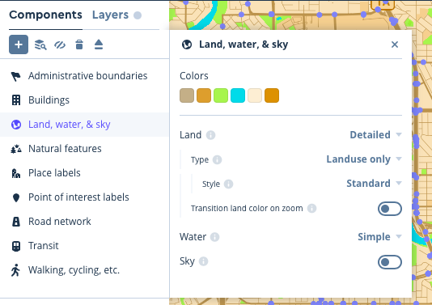
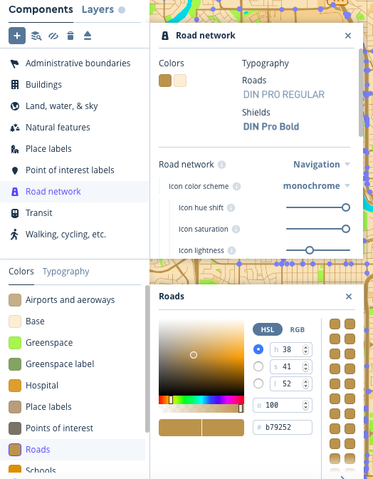
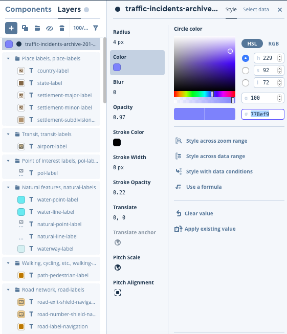

# Project 3 ENGO 551
## This is an extension of project 2

### The Map - Components 
To create the style layer I made adjustments to the predefined "Basic" map in MapBox.

To start I made the base colour scheme a bit more dark, kind of a relaxing autumn vibe.
I also made the Parks very green and the Waterbodies very blue so they would pop and be distinguished from the land and roads.

Since the main data is the car crashes in 2017, I decided to make the roads extra dark so they can be easily seen, I also made them a bit thicker.

### The Map - Layer
The Layer for this map is a circle with a radius of 4px, and opacity of 0.97, a blur of 0, and no stroke width. I thought with so many points, having a point outlines just increases the cluttered look. The smaller size of the points is also meant to reduce the cluttered look. For colour I went with 778ef9 which is a purple-blue. It is a soft colour so it wont give the user a headache but contrast the map enough to stand out. 

